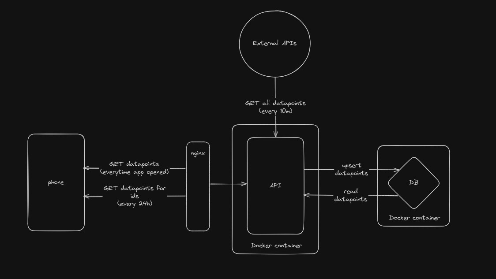

# Infone - backend

Infone is a simple application that sends small data points to the user every day in the form of a notification.
A user can choose which data points they want to receive and at what time they want to receive them.
This is the backend part of the application which only fetches + stores data points and responds to requests.

## Architecture

The backend is a simple Spring Boot application that uses GrugDB (a custom file-based database) to store the data points.
The application can run locally or in a Docker container.
New data points can be easily added by defining a @Component that implements DataPointFetcher.
DataFetcherRunner is run every 10 minutes which updates the data points in the database.

## See also
Android app: https://github.com/tatuaua/infone-app